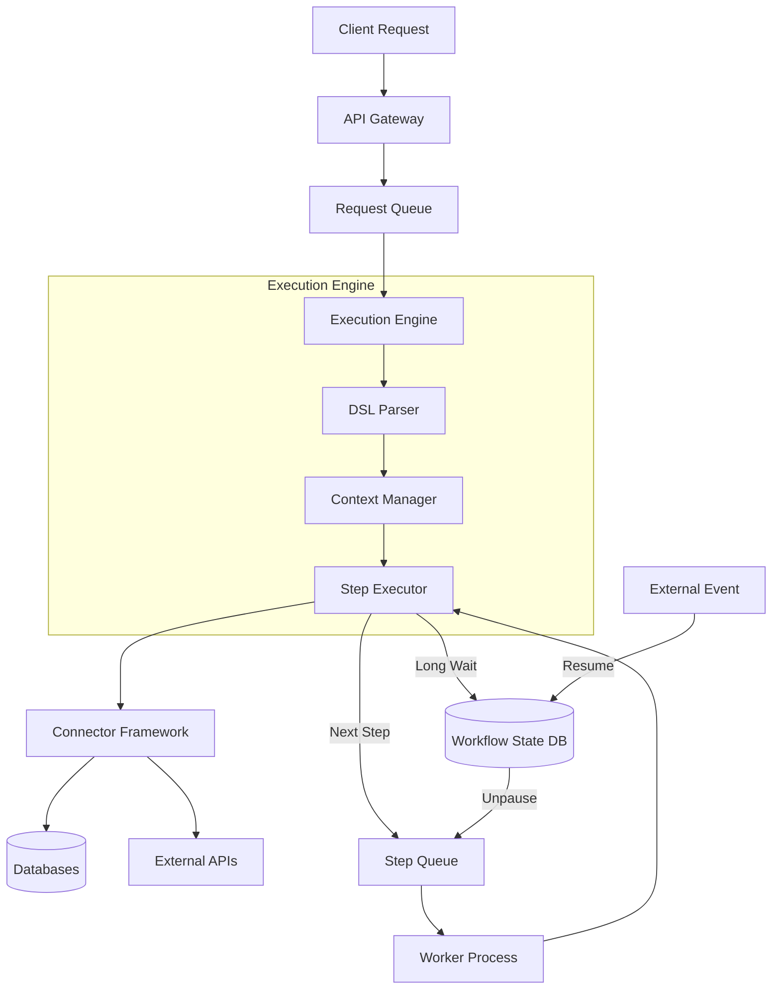

# 🏗️ Runtime Architecture Design: Execution Engine

## 1. Overview
The Execution Engine is the heartbeat of the BOS. It interprets the DSL (Flow Definitions), manages state, executes steps via connectors, and handles concurrency. It must be **non-blocking**, **tenant-isolated**, and **horizontally scalable**.

---

## 2. Threading & Concurrency Model

We adopt an **Event-Driven, Non-Blocking I/O** model (Node.js/Go style) for the core engine to handle high concurrency with low resource overhead.

### 2.1 The Actor Model (Logical)
Each **Flow Execution** is treated as a lightweight "Actor" or context.
*   **Isolation:** Each execution has its own `ExecutionContext` (input, output, state, tenantId).
*   **No Shared Mutable State:** Steps do not share memory directly; they pass data immutably through the context.

### 2.2 Physical Threading
*   **Main Event Loop:** Handles incoming API requests, parses DSL, and queues initial steps.
*   **Worker Threads (CPU Bound):** Offload heavy transformations (crypto, large JSON parsing, data mapping) to a thread pool to prevent blocking the event loop.
*   **Async I/O (IO Bound):** Database calls, HTTP requests, and queue interactions are non-blocking async operations.

### 2.3 Concurrency Control
*   **Per-Tenant Rate Limiting:** Token bucket algorithm applied at the entry point based on `tenantId`.
*   **Step-Level Timeout:** Every step has a configurable timeout. If exceeded, the step is killed, and the error handler triggers.

---

## 3. Queue System Architecture

We utilize a **Hierarchical Queue Strategy** to separate concerns between "Fast Flows" (API responses) and "Long Processes" (Workflows/Jobs).

### 3.1 Queue Types

| Queue Type | Technology | Purpose | Guarantee |
| :--- | :--- | :--- | :--- |
| **Request Queue** | In-Memory / Redis | Incoming API requests waiting for thread availability. | Best Effort |
| **Step Queue** | Redis Streams | Individual steps within a flow ready for execution. | At-Least-Once |
| **Workflow Queue** | Persistent DB (Postgres) | Long-running flows waiting for delays or external events. | Exactly-Once |
| **Job Queue** | Redis / RabbitMQ | Background jobs (emails, batch processing). | At-Least-Once |

### 3.2 Flow Execution Lifecycle in Queues
1.  **Ingest:** Request hits API → Pushed to `Request Queue`.
2.  **Dispatch:** Engine picks request → Parses Flow → Pushes Step 1 to `Step Queue`.
3.  **Execute:** Worker picks Step 1 → Executes Connector → Updates Context.
4.  **Chain:** If Step 1 success → Push Step 2 to `Step Queue` (Recursive/Iterative).
5.  **Wait:** If Step is "Delay" or "User Input" → Persist State to DB → Remove from Queue.
6.  **Resume:** External Event/Webhook → Loads State → Pushes Next Step to `Step Queue`.

---

## 4. Scaling Strategy

### 4.1 Horizontal Scaling (Stateless Engine)
The Execution Engine itself is **stateless**.
*   **Context Storage:** Execution state is stored in Redis (for active flows) or Postgres (for paused workflows).
*   **Deployment:** Can scale K8s pods based on CPU/Memory or Queue Depth (KEDA).

### 4.2 Database Sharding (Tenant Isolation)
*   **Routing Key:** `tenantId` is the primary sharding key.
*   **Strategy:**
    *   **Small Tenants:** Shared database schema, isolated by `tenant_id` column.
    *   **Enterprise Tenants:** Dedicated schema or dedicated database instance.

### 4.3 Connector Pooling
*   Database connections (SQL/Mongo) are pooled per worker process.
*   Connection limits are enforced per tenant to prevent "noisy neighbor" issues.

---

## 5. Error Handling & Resilience

### 5.1 Retry Strategies
*   **Transient Errors (5xx, Network):** Exponential backoff retry (e.g., 1s, 2s, 4s, 8s).
*   **Permanent Errors (4xx, Validation):** Immediate failure → Trigger Error Flow.

### 5.2 Dead Letter Queue (DLQ)
*   Steps failing after max retries are moved to DLQ.
*   Admin dashboard allows inspecting and replaying DLQ messages.

### 5.3 Circuit Breakers
*   Applied to external connectors (e.g., Stripe, SendGrid).
*   If failure rate > threshold, open circuit → Fail fast → Prevent cascade.

---

## 6. Data Flow Diagram (Simplified)

---

## 7. Technology Stack Recommendation

*   **Runtime:** Node.js (TypeScript) - High ecosystem for JSON/DSL handling, non-blocking I/O.
*   **Queue:** Redis (Streams for steps, Lists for jobs).
*   **Database:** PostgreSQL (Relational data, workflow state), MongoDB (Unstructured logs/data).
*   **Orchestration:** Kubernetes (Scaling).
*   **Observability:** OpenTelemetry + Prometheus/Grafana.

---

## 8. Implementation Plan (Phase 0 & 1 Alignment)

1.  **Context Class:** Implement immutable context object passing.
2.  **Step Executor:** Switch-case logic for `action`, `condition`, `transform`.
3.  **Redis Integration:** Wrap Redis client for queue pushing/popping.
4.  **Connector Interface:** Define standard `execute(input, config)` interface.
